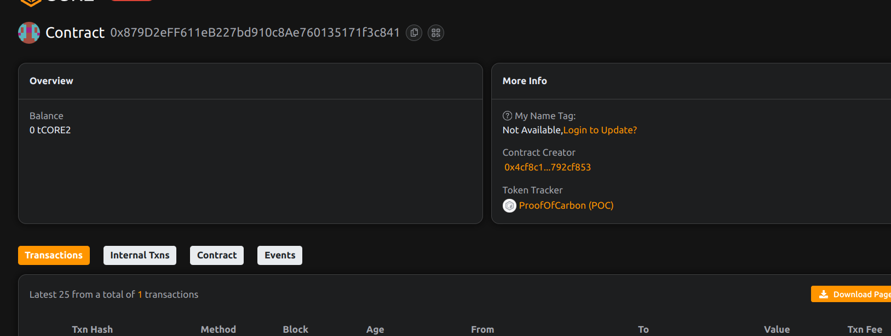

# ProofOfCarbon: Tokenized Carbon Footprint Verification System
   
## Project Description
ProofOfCarbon is a blockchain-based carbon credit verification and tokenization platform that brings transparency to environmental sustainability efforts. It creates an immutable record of carbon offset projects and issues tradable tokens representing verified carbon credits.
 
## Project Vision
To establish a global standard for carbon credit verification by:
- Providing tamper-proof records of carbon offset projects
- Enabling transparent trading of carbon credits
- Incentivizing sustainable business practices
- Creating auditable environmental impact reports  
   
## Key Features
- ERC-20 token representing carbon credits
- Role-based verification system
- Immutable project records
- Transparent credit issuance
- Audit trail for all transactions
- Prevention of double-counting

## Future Scope
- Integrate with IoT devices for real-time emissions data
- Develop carbon credit marketplace
- Implement cross-chain compatibility
- Add staking mechanisms for long-term holders
- Create DAO for governance decisions 
   
## Contract Details  
0x879D2eFF611eB227bd910c8Ae760135171f3c841   

